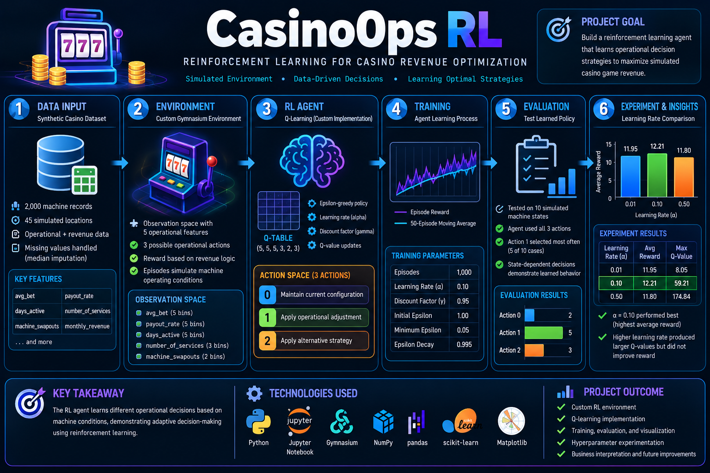

# 🎰 CasinoOps RL
## Reinforcement Learning for Casino Revenue Optimization


---

## 📊 Project Architecture & Workflow



---

# 📌 Project Overview

**CasinoOps RL** is a reinforcement learning capstone project that explores how an intelligent agent can learn operational decision strategies from simulated casino gaming data.

I built a custom reinforcement learning environment using **Gymnasium** and implemented a **tabular Q-learning agent from scratch** using Python and NumPy.

The project is modeled as a **one-step reinforcement learning decision problem**. For each episode, the agent observes the operating condition of a simulated casino gaming machine, selects one of three operational actions, receives an immediate reward, and the episode ends.

The complete workflow includes:

**Data Preparation → Environment Design → State Discretization → Q-Learning → Training → Evaluation → Baseline Comparison → Hyperparameter Experimentation → Business Interpretation**

> **Note:** This project uses synthetic data and a simulated reward system. It is a technical proof of concept and is not intended to provide real-world casino operational or gambling recommendations.

---

# 🎯 Business Problem

Casino gaming environments can generate operational data related to machine activity, wagering behavior, payouts, maintenance, and revenue.

A traditional predictive model asks:

> **What outcome is likely to occur?**

This reinforcement learning project explores a different question:

> **Given the current operating conditions, which operational action should the agent select to maximize its immediate expected reward?**

The goal is to demonstrate how reinforcement learning can support **state-dependent decision-making**, where different machine conditions can lead to different actions.

---

# 🗂️ Dataset

The project uses a **synthetic casino revenue dataset** containing:

- **2,000 machine records**
- **45 simulated locations**
- Operational and revenue-related variables
- Machine activity and maintenance information
- Monthly revenue measurements

The dataset was created for educational experimentation.

### Key Features

| Feature | Description |
|---|---|
| `machine_id` | Unique machine identifier |
| `location_id` | Simulated location identifier |
| `store_name` | Fictional location name |
| `game_type` | Game category |
| `location_type` | Type of operating location |
| `distance_from_hq_miles` | Simulated distance from headquarters |
| `days_active` | Number of active operating days |
| `avg_bet` | Average wager amount |
| `payout_rate` | Machine payout rate |
| `total_in` | Total amount wagered |
| `total_out` | Total amount paid out |
| `total_net` | Net gaming activity |
| `number_of_services` | Number of service events |
| `machine_swapouts` | Number of machine replacements |
| `monthly_revenue` | Monthly revenue |

Missing numerical values were handled using **median imputation** before constructing the reinforcement learning environment.

---

# 🧠 Reinforcement Learning Design

The project uses a custom **Gymnasium** environment.

Each episode represents a **single operational decision**:

```text
Machine State
     ↓
Agent Observes Conditions
     ↓
Select Operational Action
     ↓
Environment Calculates Reward
     ↓
Q-Value Updated
     ↓
Episode Ends
```

The environment defines:

- Observation space
- Action space
- State representation
- State-dependent reward calculation
- Environment reset behavior
- Episode termination

Because the environment terminates after one action, the agent learns directly from the **immediate measured reward** rather than estimating a long sequence of future rewards.

---

# 👁️ Observation Space

The agent observes five operational variables:

```text
avg_bet
payout_rate
days_active
number_of_services
machine_swapouts
```

Because tabular Q-learning requires discrete states, the numerical state variables are transformed using Scikit-learn's:

```python
KBinsDiscretizer
```

### State Discretization

| Feature | Bins |
|---|---:|
| Average Bet | 5 |
| Payout Rate | 5 |
| Days Active | 5 |
| Number of Services | 3 |
| Machine Swapouts | 2 |

This produces a manageable discrete state representation for the tabular Q-learning agent.

---

# 🎮 Action Space

The agent can select one of three simulated operational actions:

| Action | Operational Decision |
|---:|---|
| **0** | Maintain |
| **1** | Increase Bet |
| **2** | Adjust Payout |

The reward design is **state-dependent**, meaning an operational adjustment can produce different outcomes depending on the current machine conditions.

As a result, an action that performs well for one simulated machine state may perform poorly for another.

---

# 🏆 Reward Design

The reward function is designed to evaluate the immediate simulated result of an operational decision.

The environment allows actions to produce both:

- **Positive rewards**
- **Negative rewards**

depending on the machine's operating state.

This was an important part of the project design because it prevents the agent from receiving an automatic advantage simply for choosing a particular action.

The agent must instead learn which action tends to produce stronger rewards for different discretized machine states.

---

# 🤖 Q-Learning Agent

The agent was implemented directly using **Python and NumPy**.

The Q-table has the following dimensions:

```text
(5, 5, 5, 3, 2, 3)
```

The first five dimensions represent the discretized state variables.

The final dimension represents the three available actions.

Because this is a **one-step environment**, the project uses the following immediate-reward Q-value update:

```text
Q(s,a) = Q(s,a) + α[r - Q(s,a)]
```

Where:

```text
α = Learning rate
r = Immediate measured reward
s = Current state
a = Selected action
```

There is no future-state bootstrapping term in the final update because each episode terminates immediately after the selected action.

---

# 🔍 Exploration vs. Exploitation

The agent uses an **epsilon-greedy policy**.

Training begins with:

```text
epsilon = 1.0
```

This encourages exploration of different actions.

Epsilon gradually decreases until reaching:

```text
epsilon_min = 0.05
```

This shifts the agent toward greater use of its learned Q-values while maintaining a small amount of exploration.

---

# ⚙️ Training Configuration

The primary agent was trained using:

| Parameter | Value |
|---|---:|
| Training Episodes | 1,000 |
| Learning Rate (`alpha`) | 0.10 |
| Initial Epsilon | 1.00 |
| Minimum Epsilon | 0.05 |
| Epsilon Decay | 0.995 |
| Environment Type | One-step decision environment |

Because each episode contains only one operational decision, a future-reward discount factor is not used in the final Q-value update.

---

# 📈 Training Analysis

Training performance was analyzed using:

- Episode rewards
- Average reward
- Moving-average reward
- Q-value statistics
- Non-zero learned Q-values
- Agent action behavior

A **50-episode moving average** was used to reduce short-term noise and make the overall reward behavior easier to interpret.

The complete training plots and outputs are available in the Jupyter notebook.

---

# 🧪 Agent Evaluation

After training, the learned policy was evaluated across **100 simulated machine states**.

The evaluation recorded:

- Selected action
- Measured reward
- Learned Q-value
- Machine operating state

Testing across many states provides a stronger evaluation than examining only a few individual examples.

The evaluation showed that the agent learned **state-dependent decision behavior** rather than simply applying the same action to every machine condition.

---

# ⚖️ Fixed-Policy Baseline Comparison

To determine whether the learned policy provided value beyond a simple fixed strategy, the learned agent was compared with three fixed-action policies:

- **Always Maintain**
- **Always Increase Bet**
- **Always Adjust Payout**
- **Learned Q-Learning Policy**

All policies were evaluated using the **same 100 machine states** with a fixed random seed for reproducibility.

### Final Policy Comparison

| Policy | Average Reward | Reward Std. Dev. | Minimum Reward | Maximum Reward |
|---|---:|---:|---:|---:|
| Always Adjust Payout | 14.01 | 16.66 | -16.03 | 91.33 |
| Always Increase Bet | 14.15 | 19.69 | -54.80 | 69.78 |
| **Always Maintain** | **18.87** | 17.97 | 0.07 | 91.33 |
| Learned Q-Learning Policy | **18.53** | 18.26 | -7.12 | 91.33 |

In this evaluation, **Always Maintain produced the highest average measured reward at 18.87**, while the learned Q-learning policy achieved **18.53**.

The difference was approximately:

```text
0.34 reward points
```

The learned policy therefore performed similarly to the strongest fixed-action baseline but **did not outperform it in this run**.

This is an important result because it demonstrates why reinforcement learning agents should be evaluated against simple baseline strategies rather than judged only by their training rewards.

The comparison also showed that **Increase Bet** and **Adjust Payout** could generate negative rewards for certain machine states.

---

# 🧠 Learned Agent Behavior

The agent did not simply learn that one operational action was universally best.

Instead, action selection depended on the discretized machine state.

This provides evidence that the agent developed a **state-dependent policy**.

However, the baseline comparison also revealed an important limitation: learning a state-dependent policy does not automatically mean that the learned strategy is better than a simple fixed policy.

This distinction became one of the most important findings of the project.

---

# 🔬 Hyperparameter Experiment

A learning-rate experiment was performed to study how the Q-learning update rate affected training.

Three learning rates were compared:

```text
α = 0.01
α = 0.10
α = 0.50
```

Each configuration was trained for:

```text
1,000 episodes
```

### Experimental Results

| Learning Rate | Average Reward | Maximum Q-Value | Non-Zero Learned Q-Values |
|---:|---:|---:|---:|
| **0.01** | **18.36** | 7.41 | 260 |
| 0.10 | 16.81 | 30.32 | 275 |
| 0.50 | 17.83 | 71.09 | 264 |

In this experimental run, **α = 0.01 produced the highest average reward at approximately 18.36**.

The experiment also showed that increasing the learning rate produced substantially larger maximum Q-values:

```text
α = 0.01 → Maximum Q ≈ 7.41
α = 0.10 → Maximum Q ≈ 30.32
α = 0.50 → Maximum Q ≈ 71.09
```

However, larger Q-values did **not** correspond to higher average reward.

This demonstrates why reinforcement learning hyperparameters should be evaluated experimentally rather than selected based only on the magnitude of learned values.

Because the environment includes randomized state selection and epsilon-greedy exploration, experimental results may vary between runs.

---

# 💡 Key Findings

The project produced several important findings:

- A custom Gymnasium environment can transform operational data into an RL decision problem.
- Continuous operating variables can be converted into discrete states for tabular Q-learning.
- The agent learned different actions for different machine conditions.
- State-dependent reward design allowed actions to generate both positive and negative outcomes.
- Epsilon decay shifted the agent from exploration toward exploitation.
- A learned state-dependent policy does not automatically outperform a simple baseline.
- **Always Maintain achieved an average reward of 18.87 compared with 18.53 for the learned policy in the final evaluation.**
- Learning rate significantly affected Q-value magnitude and training behavior.
- In the final learning-rate experiment, **α = 0.01 produced the highest average training reward**.
- Baseline comparisons are essential when evaluating whether an RL policy provides meaningful improvement.

---

# 📊 Project Results at a Glance

| Area | Result |
|---|---|
| Dataset | 2,000 synthetic machine records |
| Locations | 45 simulated locations |
| Environment | Custom Gymnasium environment |
| Environment Type | One-step decision problem |
| Algorithm | Tabular Q-Learning |
| State Features | 5 |
| Available Actions | 3 |
| Training Episodes | 1,000 |
| Final Exploration Rate | 0.05 |
| Evaluation States | 100 |
| Fixed Policies Compared | 3 |
| Learned Policy Avg. Reward | 18.53 |
| Strongest Fixed Baseline | Always Maintain |
| Strongest Fixed Baseline Avg. Reward | 18.87 |
| Learning Rates Tested | 0.01, 0.10, 0.50 |
| Highest Experimental Avg. Reward | 18.36 at α = 0.01 |

---

# ⚠️ Limitations

This project is a technical proof of concept built using a simplified simulated environment.

Major limitations include:

- Synthetic data
- Simulated reward logic
- Limited action space
- Limited observation space
- One-step episodes
- Random exploration
- No long-term state transitions
- No real-world casino operational validation

Because each episode terminates after one action, the agent learns from an immediate measured reward and does not model the long-term consequences of operational decisions.

The learned policy also did not outperform the strongest fixed baseline in the final evaluation.

These limitations are important when interpreting the results.

The project demonstrates reinforcement learning concepts within a simulated environment and should not be interpreted as a production casino decision system.

---

# 🔮 Future Improvements

Future versions of the project could include:

- Multi-step episodes
- Long-term state transitions
- More sophisticated reward shaping
- Additional operational actions
- Larger state spaces
- Multiple random-seed experiments
- Separate training and testing environments
- Additional hyperparameter experiments
- Automated experiment tracking
- Larger or more realistic datasets
- Deep reinforcement learning
- DQN comparison
- PPO comparison

A multi-step environment would be particularly valuable because it would allow the agent to learn how current actions affect future states and future rewards.

---

# 🛠️ Technologies Used

| Technology | Purpose |
|---|---|
| **Python** | Core development language |
| **JupyterLab** | Interactive development and analysis |
| **Pandas** | Data manipulation |
| **NumPy** | Q-table and numerical operations |
| **Scikit-learn** | State discretization |
| **Gymnasium** | Custom reinforcement learning environment |
| **Matplotlib** | Training and performance visualization |
| **Git** | Version control |
| **GitHub** | Project documentation and portfolio hosting |
| **Ubuntu Linux** | Development environment |

---

# 💼 Skills Demonstrated

### Data Science

- Data preparation
- Missing-value handling
- Feature selection
- Data transformation
- Experimental analysis
- Data visualization
- Result interpretation

### Machine Learning

- Reinforcement learning
- Tabular Q-learning
- Hyperparameter experimentation
- Policy evaluation
- Baseline comparison
- State discretization

### Reinforcement Learning

- Custom Gymnasium environments
- Observation spaces
- Action spaces
- State-dependent reward functions
- Q-tables
- Q-value updates
- Epsilon-greedy policies
- Exploration vs. exploitation
- Policy evaluation
- Hyperparameter analysis

### Software & Engineering

- Python development
- Linux
- Virtual environments
- JupyterLab
- Git
- GitHub
- Technical documentation
- Reproducible project organization

---

# 🏗️ Repository Structure

```text
casino-revenue-rl-optimization/
│
├── capstone.png
│
├── data/
│   └── casino_game_revenue_revised_with_store_names.csv
│
├── notebooks/
│   └── casino_revenue_rl_optimization.ipynb
│
├── .gitignore
├── README.md
└── requirements.txt
```

---

# 🚀 Running the Project

### 1. Clone the Repository

```bash
git clone https://github.com/christran85-cyber/casino-revenue-rl-optimization.git
```

### 2. Enter the Project Directory

```bash
cd casino-revenue-rl-optimization
```

### 3. Create a Virtual Environment

```bash
python3 -m venv .venv
```

### 4. Activate the Environment

```bash
source .venv/bin/activate
```

### 5. Install Dependencies

```bash
pip install -r requirements.txt
```

### 6. Start JupyterLab

```bash
jupyter lab
```

Open:

```text
notebooks/casino_revenue_rl_optimization.ipynb
```

Run the notebook from top to bottom.

---

# 🎯 Project Outcome

This project demonstrates an end-to-end reinforcement learning workflow:

```text
Synthetic Dataset
      ↓
Data Preparation
      ↓
State Representation
      ↓
State Discretization
      ↓
Custom Gymnasium Environment
      ↓
Tabular Q-Learning Agent
      ↓
Training
      ↓
100-State Policy Evaluation
      ↓
Fixed-Policy Baseline Comparison
      ↓
Learning-Rate Experiment
      ↓
Business Interpretation
      ↓
Limitations & Future Improvements
```

The project demonstrates how a business-oriented decision problem can be translated into a functioning reinforcement learning experiment using **Python, Gymnasium, NumPy, Pandas, Scikit-learn, and Matplotlib**.

Most importantly, the project demonstrates the importance of **honest model evaluation**. Although the agent learned state-dependent behavior, it did not outperform the strongest fixed baseline in the final evaluation. That result provides a clear direction for future improvements to the environment, reward design, and learning process.

---

# 👨‍💻 Author

**Chris Tran**

Building hands-on projects across:

- Data Science & Machine Learning
- Cloud Engineering
- IT Infrastructure
- Cybersecurity

---

## ✅ Project Status

**Complete**

**Module 2 Data Science Capstone — Reinforcement Learning**
